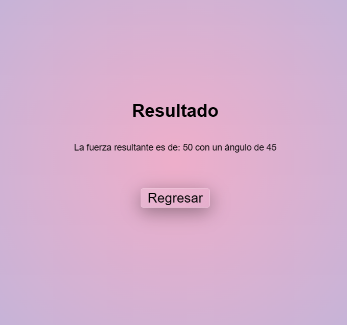

<p align="center">
  
</p>

# Proyecto final

Este es un simple proyecto final para la materia de física, la cual engloba todos los temas vistos con anterioridad en la clase.

## Guía de iniciación

Este proyecto ya viene con todo incluido para su uso, ya que no cuenta con librerias externas, lo unico de lo que se nececitará para su uso es conexión a internet, ya que las fuentes vienen de [google fonts](https://fonts.google.com/).

Eso si, se necesitará de un servidor php, se puede hacer con [xampp](https://www.apachefriends.org/download.html) o si ya se cuenta con php instalado en el pc, solamente se tiene que correr el servidor de desarrollo dentro de la carpeta del proyecto con `php -S localhost:port`.

## Carpetas principales

Todos los archivos principales del proyectos se encuentran dentro de la carpeta `src` dentro de las cuales se encuentran:

- **index.php**
  Aquí se encuentra el archivo que se va a abrir primero en el servidor. El cual tiene un menú en el cual el usuario puede escoger que función del programa desea usar 

- **assets**
  En esta carpeta se guradan todas las utilidades externas que se usaron, principalmente imágenes, incluyendo las imágenes de esta documentación
- **css**
  Aquí se encuentran todos los archivos css, `normalize.css` y ``main.css``
- **js**
  En esta carpeta se guardan todos los archivos de javascript que se utilizaron para el correcto funcionamiento de la vista del usuario
- **php**
  Dentro de esta carpeta se encuentran todos los archivos php en los que se encuentra la lógica para llegar a los resultados.
- **view**
  Dentro de esta carpeta se encuentran todos los archivos php necesarios para la vista del usuario, esta es la carpeta a la que dependiendo de la selección del usuario en el index, va a mandarlo a uno de estos archivos

## Funcionalidad principal de los archivos

### Index.php

Dentro de este archivo solo nos encontramos un HTML básico en el cual nos encontraremos con 3 botones, cada uno va a redirigir a la sección que el usuario desee en la parte de view *e.g.* `src/view/fiveFormulas.php`

```PHP
<!DOCTYPE html>
<html lang="en">
<head>
    <meta charset="UTF-8">
    <meta http-equiv="X-UA-Compatible" content="IE=edge">
    <meta name="viewport" content="width=device-width, initial-scale=1.0">
    <title>Calculadora Fuerza</title>
    <link rel="preconnect" href="https://fonts.googleapis.com">
    <link rel="preconnect" href="https://fonts.gstatic.com" crossorigin>
    <link href="https://fonts.googleapis.com/css2?family=Poppins&display=swap" rel="stylesheet">    
    <link rel="stylesheet" href="/src/css/main.css">
    <link rel="stylesheet" href="/src/css/normalize.css">
</head>

<body>
    <div id="app" class="app">
        <div>
            <h1 class="title">¿Que quiere calcular?</h1>
            <button class="button" id="btnSecondNewtonLaw">Segunda ley de newton</button>
            <button class="button" id="btnAccelerationFormula">Fórmulas de la aceleración</button>
            <button class="button" id="btnSumaVectorial">Suma vectorial</button>
        </div>
    </div>
    <script src="/src/js/buttonRedirectionIndex.js"></script>
    <script src="/src/view/aceleration.php"></script>
</body>

</html>
```

Código de index.php

### Archivos js

#### buttonRedirectionIndex.js

Dentro de estos archivos se encuentra la funcionalidad para redireccionar al usuario del index.php a la página deseada del view, cuenta con 3 secciones principales.

La declaración de los botones. Primero se declaran los 3 botones para poder ser identificados por js y poder agregar un evento de escucha.

```JS
  const btnSecondNewtonLaw = document.getElementById("btnSecondNewtonLaw")
  const btnAccelerationFormula = document.getElementById("btnAccelerationFormula")
  const btnSumaVectorial = document.getElementById("btnSumaVectorial")
```

Después se le agrega a cada uno de los botones un evento de escucha para que el usuario pueda ser redirigido a la página deseada.

```JS
  btnSecondNewtonLaw.addEventListener("click", () => {
      location.href = "/src/view/force.php"
  })

  btnAccelerationFormula.addEventListener("click", () => {
      location.href = "/src/view/fiveFormulas.php"
  })

  btnSumaVectorial.addEventListener("click", () => {
      location.href = "/src/view/vectorialSum.php"
  })
```

#### main.js

Dentro de este archivo ``main.js`` se encuentra la funcionalidad para cambiar las unidades de medida del sistema internacional al sistema inglés en las secciones en las que sea necesario.

Primero se detectan 2 radioButtons, los cuales son *isRadio* y *usRadio* los cuales representan el sistema internacional y el sistema ingles respectivamente

```js
const isRadio = document.getElementById("is")
const usRadio = document.getElementById("us")
```

Despues, para cada uno de los radio buttons se le agrega un evento de escucha de *click* para que al hacer click sobre alguno de ellos se cambien los placeholders de los inputs necesarios (dentro de el cálculo para la segunda ley de Newton).

```js
isRadio.addEventListener("click", (e) => {
    const weightInput = document.getElementById("weight_input")
    const massInput = document.getElementById("mass_input")
    const acelerationInput = document.getElementById("aceleration_input")
    
    weightInput.setAttribute("placeholder", "N")
    massInput.setAttribute("placeholder", "Kg")
    acelerationInput.setAttribute("placeholder", "m/s²")
})

usRadio.addEventListener("click", () => {
    const weightInput = document.getElementById("weight_input")
    const massInput = document.getElementById("mass_input")
    const acelerationInput = document.getElementById("aceleration_input")

    weightInput.setAttribute("placeholder", "lb")
    massInput.setAttribute("placeholder", "slugs")
    acelerationInput.setAttribute("placeholder", "ft/s²")
})
```

#### changingPlaceHoldersXFormula

Al momento de llegar a las 5 fórmulas se utilizó un archivo js independiente para cada view, ya que los inputs pueden variar dentro de las fórmulas, la funcionalidad general de estos archivos es:

- Se toman los radioButtons del sistema internacional y del sistema ingles respectivamente como en el main.js, solo que ahora también vamos a obtener el **form**, esto con la finalidad de **validar** que el usuario **llene todos los campos**

```js
const isRadio = document.getElementById("is")
const usRadio = document.getElementById("us")
const form = document.getElementById("form")
```

- Se le añade un evento de escucha a cada radioButton para cmabiar los placeholders de los inputs, como en ejemplo del main.js, solo que en cada vista nueva el id de los inputs cambia, por lo cual no se puede simplemente reutilizar el codigo anterior.

```js
isRadio.addEventListener("click", (e) => {
    const initial_velocity_input = document.getElementById("initial_velocity_input")
    const final_velocity_input = document.getElementById("final_velocity_input")
    const time_input = document.getElementById("time_input")
    
    initial_velocity_input.setAttribute("placeholder", "m/s²")
    final_velocity_input.setAttribute("placeholder", "m/s²")
    time_input.setAttribute("placeholder", "s")
})

usRadio.addEventListener("click", () => {
    const initial_velocity_input = document.getElementById("initial_velocity_input")
    const final_velocity_input = document.getElementById("final_velocity_input")
    const time_input = document.getElementById("time_input")

    initial_velocity_input.setAttribute("placeholder", "ft/s²")
    final_velocity_input.setAttribute("placeholder", "ft/s²")
    time_input.setAttribute("placeholder", "s")
})
```

- Se le añade un evento de escucha **submit** al form, y dentro de este se detiene su funcionamiento principal con `e.preventDefault()` esto con la finalidad de que la página no se recargue al enviar los datos y primero validarlos.
  
  Posteriormente se crean variables para cada input, esto para dentro de un if, verificar que todos los inputs esten llenos. Si todos los inputs están llenos se procede con el submit del form con `form.submit()`, en caso contrario, se le notifica al usuario de que llene los campos

```js
form.addEventListener("submit", (e) => {
    e.preventDefault()
    const initial_velocity_input = document.getElementById("initial_velocity_input")
    const final_velocity_input = document.getElementById("final_velocity_input")
    const time_input = document.getElementById("time_input")

    if (!(initial_velocity_input.value == "" || final_velocity_input.value == "" || time_input.value == "")) {
        form.submit()
    } else {
        alert("Llene los campos")
    }
})
```

#### addingVectors.js

La funcionalidad principal de este archivo es para que el usuario pueda agregar la *n* cantidad de vectores que nececite para la suma vectorial

Lo primero que hace el archivo es obtener el formulario, el un botón `btnCrearVectores` e inicializar una variable llamada `nVectores` este último con la finalidad de obtener el número de vectores que el usuario necesita.

```js
const form = document.getElementById("form")
const btnCrearVectores = document.getElementById("btnCrearVectores")
let nVectores
```

Posteriormente se le añade un evento de escucha al botón y se le le interrumpe su funcionalidad default

```js
btnCrearVectores.addEventListener("click", (e) => {
    e.preventDefault()
})
```

A partir de ahora todo el código restante (de este archivo) se encontrará dentro de esta función `addEventListener()`

Primero se crean 2 variables, una llamada `vectoresInput` la cual es un input que se encuentra en la vista, dentro de la cual el usuario va a introducir la cantidad de vectores que desea utilizar; y otra llamada `submitCalcular` la cual es un botón de tipo *submit* el cual utilizaremos mas adelante.

Posteriormente a `nVectores` se le asigna el valor del input del número de vectores.

```js
const vectoresInput = document.getElementById("nVectores")
const submitCalcular = document.createElement("input")
nVectores = vectoresInput.value
```

Al `submitCalcular` se le van a añadir 3 atributos:

- **type:** para el tipo del input, el cual va a ser sumbit
- **value:** para el texto que va a tener este submit
- **class:** para añadir estilos posteriormente.

```js
submitCalcular.setAttribute("type", "submit")
submitCalcular.setAttribute("value", "calcular")
submitCalcular.setAttribute("class", "submit-calcular")
```

Posteriormente se crea un `for` el cual va a iterar desde 0 hasta la cantidad de vectores, la cual se va a encargar de crear los inputs para cada vector, con su magnitud y su dirección (en Newtons y en grados)

```js
for(i = 0; i<nVectores; i++)
```

Dentro de ese for se realizan las siguientes acciones:

- Se crean 4 variables, dos labels y 2 inputs, los cuales 2 para la magnitud y 2 para la dirección respectivamente.

  ```js
  let magnitudLabel = document.createElement("label")
  let direcccionLabel = document.createElement("label")
  let magnitudInput = document.createElement("input")
  let direccionInput = document.createElement("input")
  ```

- Se crea un div, el cual se utilizará mas adelante, a este se le va a añadir la clase "vector-inputs-container" esto con la finalidad de agregar estilos posteriormente

  ```js
  let div = document.createElement("div")
  div.setAttribute("class", "vector-inputs-container")
  ```

- A los 2 labels se les añade el atributo "for" para identificarlos y dentro de su HTML se le introduce el texto para saber a que input van dirigidos.

  ```js
  magnitudLabel.setAttribute("for", "magnitud")
  direcccionLabel.setAttribute("for", "direccion")
  magnitudLabel.innerHTML = "Magnitud"
  direcccionLabel.innerHTML = "Dirección: (ángulo polar)"
  ```

- Se le añade a los 2 inputs los atributos necesarios con sus valores.
  - **name:** para identificarlo en el metodo GET que vamos a utilizar posteriormente (este atributo es dinámico, ya que su valor toma el nombre de "direccion" mas el valor de la iteración)
  - **id:** Para poder identificarlo (este atributo también es dinámico, toma un valor de "direccion" mas el valor de la iteración al igual que el anterior)
  - **placeholder:** para añadir un placeholder y que el usuario sepa que debe ingresar
  - **type:** para darle un tipo al input y que solo se puedan introducir números.
  - **step:** para que se puedan añadir números decimales, se le añade unv valor de "any" para que se puedan añadir cualquier tipo de decimales
  - **required:** para que el input sea requerido y no pueda irse vacío antes de subir el formulario
  - **min:** para dar un valor mínimo al input y que no se añadan valores de 0 o negativos.

  ```js
  magnitudInput.setAttribute("name", `magnitud_${i}`)
  magnitudInput.setAttribute("id", `magnitud_${i}`)
  magnitudInput.setAttribute("placeholder", `N`)
  magnitudInput.setAttribute("type", `number`)
  magnitudInput.setAttribute("step", "any")
  magnitudInput.setAttribute("required", "")
  magnitudInput.setAttribute("min", "1")

  direccionInput.setAttribute("name", `direccion_${i}`)
  direccionInput.setAttribute("id", `direccion_${i}`)
  direccionInput.setAttribute("placeholder", `° (θ)`)
  direccionInput.setAttribute("type", `number`)
  direccionInput.setAttribute("step", `any`)
  direccionInput.setAttribute("required", "")
  direccionInput.setAttribute("min", "1")
  direccionInput.setAttribute("max", "360")
  ```

- Despues de crear los inputs necesarios con sus atributos, se añaden al div y el div se añade al form respectivamente

  ```js
  div.appendChild(magnitudLabel)
  div.appendChild(magnitudInput)
  div.appendChild(direcccionLabel)
  div.appendChild(direccionInput)
  form.appendChild(div)
  ```

Una vez que el `for` ha terminado (se craron todos los inputs necesarios para la n cantidad de vectores) se eliminan del form 2 elementos hijos (un heading y el botón para generar los inputs) para que el usuario ya no pueda modificar el HTML, pero se deja el input (ya que ese valor nos va a servir posteriormente para el cálculo de los vectores) a ese input solamente se le va a añadir la clase "hidden" para que el css sea capaz de ocultarlo.

Al botón de submit que creamos anteriormente se añade al form también

```JS
form.removeChild(form.children[1])
form.removeChild(form.children[2])
form.appendChild(submitCalcular)
vectoresInput.setAttribute("class", "hidden")
```

### Archivos php

Los siguientes archivos son los encargados de la funcionalidad de la página, ya que a estos se les va a enviar la información de los inputs de los diferentes views del usuario.

#### calcForce.php

Este archivo se encarga de calclular lo necesario para la segunda ley de newton.

Este archivo es llamado desde `/src/view/force.php` desde la cual se le va a enviar datos mediante el método `GET`, que es lo primero que hace este archivo; almacenar los datod que se obtienen del *GET*

```php
$system = $_GET['system'];
$force = $_GET['force'];
$mass = $_GET['mass'];
$aceleration = $_GET['aceleration'];
```

Despues se declara una variable `$isInternationalSystem` la cual va a tomar un valor booleano dependiendo de si se escogió el sistema internacional o no

```php
$isInternationalSystem = ($system == 'isSystem') ? true : false;
```

Posteriormente se declaran 3 variables:

- `$ressult`: tomará el valor de el string final para mostrar el resultado al usuaio.
- `$empty`: tomará el valor de lo que se va a sacar (fuerza, masa o aceleración)
- `$units`: tomará el valor de las unidades de medidas

Después de eso, se inserta un if, el cual solo se ejecutará si se ha escogido el sistema internacional de unidades.

Este bloque de código verifica que input queedó vacío, esto con el fin de sabe que es lo que se queire calcular (si es fuerza, masa o aceleración) y se aplicará la formula necesaria para cada caso.

```php
if ($isInternationalSystem) {
    if (empty($force)) {
        $ressult = $mass * $aceleration;
        $units = 'N';
        $empty = "fuerza";
    }

    if (empty($mass)) {
        $ressult = $force / $aceleration;
        $units = 'Kg';
        $empty = "masa";
    }

    if (empty($aceleration)) {
        $ressult = $force / $mass;
        $units = 'm/s²';
        $empty = "aceleración";
    }
}
```

El siguiente bloque de código es otro condicional de tipo `if` el cual se ejecutará si se escoge el sitema inglés, que hace practicamente lo mismo que el anteriór bloque de código solamente que con las unidades del sistema ingles

```php
if (!$isInternationalSystem) {
    if (empty($force)) {
        $ressult = $mass * $aceleration;
        $units = 'lb';
        $empty = "fuerza";
    }

    if (empty($mass)) {
        $ressult = $force / $aceleration;
        $units = 'slugs';
        $empty = "masa";
    }

    if (empty($aceleration)) {
        $ressult = $force / $mass;
        $units = 'ft/s²';
        $empty = "aceleración";
    }
}
```

Posteriormente se tiene un HTML básico, dentro del cual se tiene un título y un párrafo en el cual se insertan nuestras variables con unidad de medida.

```php
 <p class="text">La
    <?php echo $empty ?> es:
    <?php echo $ressult;
    echo $units ?>
  </p>
```

El resultado para el usuario con los datos de 2 para fuerza y 3 para masa es:

<p align="center">
  
</p>

#### calcXFormula.php

Para calcular las 5 fórmulas para la aceleración se tienen 5 archivos diferentes, pero a grandes razgos hacen lo mismo.

Son llamados desde su archivo correspondiente para cada fórmula desde `/src/view/`

Lo primero que hacen estos archivos es obtener las variables necesarias para calcular el resultado de la fórmula (el nombre de las variables puede variar dependiendo de la fórmula que se desea utilizar).

```php
$system = $_GET['system'];
$initial_velocity = $_GET['vi'];
$final_velocity  = $_GET['vf'];
$time = $_GET['t'];
```

Después se guada una variable booleana para saber si se esta usarndo el sistema internacional o el sistema ingles.

```php
$isInternationalSystem = ($system == 'isSystem') ? true : false;
```

Posteriormente se calcula lo necesario para la fórmula (el como se obtiene el valor de esta variable puede variar dependiendo de la fórmula a utilizar)

```php
$distance = (($initial_velocity + $final_velocity) / 2) * $time;
```

Finalmente se tiene un HTML básico el en el cual se imprime el valor obtenido (se tiene mas código HTML, pero no es necesario indagar en eso en estos momentos).

```php
<p class="text"><?php echo $ressult ?></p>
```

Una demostración de como se vería esta pantalla hacia el usuario (utilizando como ejemplo la primera fórmula) con los datos para:

- Velocidad inicial: 15
- Velocidad final: 20
- Tiempo: 5

<p align="center">
  
</p>

#### calcVectores.php

Este archivo se encarga de calcular la suma vectorial. (el orden en el que aquí se muestran las cosas es el orden de ejecución, el orden del código es difernete).

Este archivo es llamado desde `src/view/vectorialSum.php` el cual contiene un form que va a enviar ciertos datos utilizando el método `GET` hacia este archivo

Lo primero que hace este archivo es instanciar 4 variables las cuales son arrays, cada uno va a almaccenar lo que su nombre lo indica.

```php
$listaMagnitudes = array(); // Almacena las magnitudes de los vectores
$listaDirecciones = array(); // Almacena las direcciones de los vectores
$valoresX = array(); // Almacena los valores x de los vectores Fcos(X)
$valoresY = array(); // Almacena los valores de y de los vectores Fsen(x)
```

Despues de eso crea una variable llamada `$nVectores` la cual va a alamcenar el número de vectores que seleccionó el usuario (desde un input vació en el HTML)

```php
$nVectores = $_GET['nVectores'];
```

Posteriormente realiza un ciclo de tipo `for` el cual se va a ejecutar desde 0 hasta `$nVecctores` el cual su funcionamiento va a ser almacenar la magnitud y la dirección de el vector con índice `$i` (estos son tomados del HTML)

Posteriormente almacena sus valores de X y de Y en los arrays `$ValoresX[$i]` y `$ValoresY[$i]` respectivamente.

Después se hace una pequeña excepción, ya que las funciones de `sin()` y  `cos()` de php solo aceptan radianes, por lo cual se nececita hacer un cambio de unidades, dentro del cuál con la función `deg2Rad()` al momento de hacer la conversión en los senos de 180 en vez de tomar un valor 0, toma un valor muy cercano a 0.

```php
for ($i=0; $i < $nVectores; $i++) { 
    $magnitud = (int)$_GET["magnitud_$i"];
    $direccion = (int)$_GET["direccion_$i"];
    
    $valoresX[$i] = ($magnitud * cos(deg2rad($direccion)));
    $valoresY[$i] = ($magnitud * sin(deg2rad($direccion)));
    
    if ($direccion == 180) $valoresY[$i] = 0;
    if ($direccion == 360) $valoresY[$i] = 0;
    if ($direccion == 0) $valoresY[$i] = 0;
}
```

Posteriormente se declaran 2 variables, las cuales son `$sumaX` y `$sumaY` las cuales van a tomar el valor que les retornen las funciones `sumarValoresX()` y `sumarValoresY()` Respectivamente.

Ya que la funcinalidad de ambas es muy similar se explicará a fondo unicamente `sumarValoresX()`.

- Lo primero que hace esta función es recibir 2 parámetros; el primero es un array el cual contiene todos los valores de x de todos los vectores, el segundo valor que recibe esta función es la cantidad de vectores que el usuario pidió.
- Posteriormente declara una variable llamada `$sumaX` y se le asigna un valor de 0
- Se instancia un ciclo `for` el cual va a recorrer desde 0 a la cantidad de vectores. Dentro de este for se va a hacer la sumatoria total de los valores de X desde el primer hasta el último vector.

```php
function sumarValoresX ($valoresX, $nVectores) {
    $sumaX = 0;

    for ($i=0; $i < $nVectores; $i++) { 
        $sumaX = $sumaX + $valoresX[$i];
    }
    
    return $sumaX;
}
```

La función de sumarValoresY hace basicamente lo mismo pero con los valores en Y de los vectores.

```php
function sumarValoresY ($valoresY, $nVectores) {
    $sumaY = 0;
    
    for ($i=0; $i < $nVectores; $i++) { 
        $sumaY = $sumaY + $valoresY[$i];
    }

    return $sumaY;
}
```

Posteriormente se declara una variable llamada `$fuerzaFinal` que adquiere el valor que le retorne la función `fuerzaFinal()`

La función `fuerzaFinal($)` recibe 2 parámetros; el primero es la sumatoria de X y el segundo es la sumatoria de Y.

La función se encarga de retornar el valor de la fuerza final con la fórmula correspondiente.

```php
function fuerzaFinal ($sumaX, $sumaY) {
    return sqrt(pow($sumaX, 2) + pow($sumaY, 2));
}
```

Despues de calcular la fuerza final, se nececita obtener el ángulo final, el cual se guarda en una variable llamada `$anguloFinal` la cual recibe el valor que retorne la funcion `anguloFinal()`.

Esta función recibe 2 valores `$sumaX` y `$sumaY` y retorna el valor correspondiente del ángulo polar dependiendo del cuadrante en el que se encuentra, eso está validado por condicionales `if` para saber en que cuadrante se encuentra, en caso de que la fuerza final no pertenezca a ningún cuadrante se retorna 0

```php
function anguloFinal ($sumaX, $sumaY) {
    if ($sumaX > 0 && $sumaY > 0) return abs(rad2deg(atan($sumaY / $sumaX)));
    
    if ($sumaX < 0 && $sumaY > 0) return 180 - abs(rad2deg(atan($sumaY / $sumaX)));
    
    if ($sumaX < 0 && $sumaY < 0) return 180 + abs(rad2deg(atan($sumaY / $sumaX)));
    
    if ($sumaX > 0 && $sumaY < 0) return 360 - abs(rad2deg(atan($sumaY / $sumaX)));

    return 0;
}
```

Posteriormente se tiene un HTML básico, en el cual, al igual que en los otros cálculos se muestra al usuario el resultado final mediante una etiqueta `<p>`

```php
<p class="text">La fuerza resultante es de: <?php echo $fuerzaFinal ?>
con un ángulo de <?php echo $anguloFinal ?></p>
```

La visualización de la página suponiendo 2 vectores, uno de 20N con un ángulo de 15° y uno de 30N con un ángulo de 45° es:

<p align="center">
  
</p>
